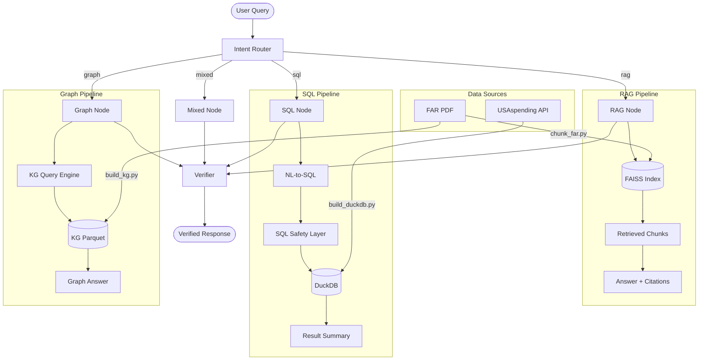

# Procurement Copilot

Enterprise Procurement Copilot demonstrating agentic AI for procurement applications. Combines citation-grounded RAG over FAR policy documents, natural-language-to-SQL analytics over USAspending data, and a lightweight knowledge graph for relationship queries.

## Tech Stack

Python 3.11+ | LangChain + LangGraph | DuckDB | FAISS | FastAPI

## Architecture



### Component Overview

| Component | Description |
|-----------|-------------|
| **Intent Router** | Classifies queries as `rag`, `sql`, `graph`, or `mixed` using keyword heuristics |
| **RAG Node** | Retrieves FAR chunks via FAISS, generates grounded answers with `[chunk_id]` citations |
| **SQL Node** | Converts natural language to SQL via templates, validates through safety layer, executes on DuckDB |
| **Graph Node** | Traverses knowledge graph triples (multi-hop BFS), produces relationship-based answers |
| **Verifier** | Checks every claim against evidence; removes unsupported claims or abstains |
| **SQL Safety** | SELECT-only, table allowlist, blocked keywords, LIMIT enforcement, read-only mode |

## Quick Start

```bash
# 1. Install dependencies
make setup

# 2. Download data (FAR PDF + USAspending awards)
make data

# 3. Build indexes (DuckDB, vector index, knowledge graph)
make build

# 4. Run tests
make test

# 5. Run linting
make lint

# 6. Start API server
make api

# 7. Run evaluation harness
make eval
```

## Demo Queries

### Policy Question (RAG)
> **Q:** What does FAR 6.302-1 say about sole-source contracting?
>
> Routes to RAG pipeline. Retrieves relevant FAR chunks, generates answer with citations like `[far_chunk_00123]` referencing specific pages.

### Analytics Question (SQL)
> **Q:** What are the top 10 recipients by total award amount?
>
> Routes to SQL pipeline. Generates `SELECT recipient_name, SUM(award_amount) ... GROUP BY ... ORDER BY ... DESC LIMIT 10`, validates through safety layer, executes on DuckDB.

### Relationship Question (Graph)
> **Q:** Show the graph triples connected to sole source
>
> Routes to Graph pipeline. Performs multi-hop traversal from "sole source" entity, returns related sections, roles, and concepts with provenance chunk IDs.

### Mixed Question
> **Q:** What does FAR say about sole-source contracting and how much has been spent?
>
> Routes to Mixed pipeline. Runs RAG for policy context + Graph for relationships, combines answers, verifies against evidence.

### SQL Safety Demo
> **Q:** DROP TABLE awards
>
> Blocked by SQL safety layer: "Only SELECT queries are allowed." No data modified.

## Project Structure

```
procurement-copilot/
  src/procurement_copilot/
    config.py                 # pydantic-settings configuration
    api/main.py               # FastAPI with /health endpoint
    rag/
      retriever.py            # FAISS retrieval + reranking
      answer.py               # RAG answer generation with citations
    sql/
      safe_sql.py             # SQL validation, safety, execution
    graph/
      query.py                # KG traversal (find_related, multi_hop)
      answer.py               # Graph answer generation
    orchestrator/
      intent.py               # Intent classification
      verifier.py             # Groundedness verification
      graph.py                # LangGraph state graph + runner
  scripts/
    download_far.py           # Download FAR PDF
    fetch_usaspending_awards.py  # Fetch USAspending data
    build_duckdb.py           # Load awards into DuckDB
    chunk_far.py              # PDF chunking (sliding window)
    build_vector_index.py     # Build FAISS index
    build_kg.py               # Extract KG triples (rule-based)
    run_eval.py               # Evaluation harness
  eval/
    gold_questions.jsonl      # 42 evaluation questions
    report.md                 # Generated evaluation report
  tests/                      # 58 tests across all modules
  data/
    raw/                      # Downloaded data (.gitignored)
    processed/                # Built indexes (.gitignored)
```

## Evaluation

The evaluation harness (`scripts/run_eval.py`) runs 42 gold questions across all pipelines and measures:

- **Intent Routing Accuracy** — correct classification of rag/sql/graph/mixed
- **Answer Rate** — percentage of questions that produce an answer
- **Keyword Recall** — expected keywords found in answers (retrieval quality proxy)
- **Groundedness Rate** — percentage of answers verified against evidence
- **SQL Execution Success** — percentage of SQL queries that execute without error
- **Avg Latency** — per-question response time

Results are written to `eval/report.md`.

## Project Status

- [x] Sprint 1 — Repo scaffolding + tooling gate
- [x] Sprint 2 — Data acquisition scripts
- [x] Sprint 3 — DuckDB build + SQL safety layer
- [x] Sprint 4 — Chunking + vector index + retrieval
- [x] Sprint 5 — KG build + GraphRAG-lite
- [x] Sprint 6 — LangGraph orchestrator + verifier
- [x] Sprint 7 — Eval harness + README finalization
