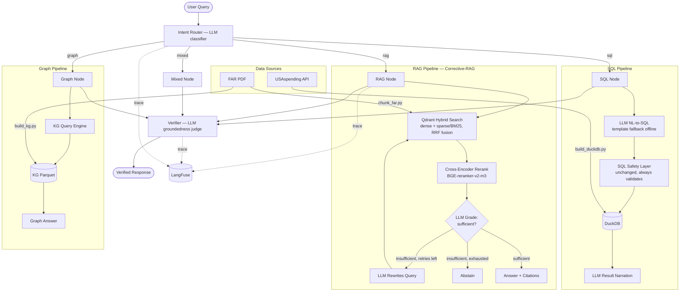

# Procurement Copilot

Enterprise Procurement Copilot demonstrating agentic AI for procurement applications. Combines citation-grounded, self-correcting RAG over FAR policy documents, natural-language-to-SQL analytics over USAspending data, and a lightweight knowledge graph for relationship queries — with full observability and semantic evaluation.

## Tech Stack

Python 3.11+ | LangChain + LangGraph | Qdrant (hybrid dense+sparse) | DuckDB | LangFuse | Ollama/Gemma | RAGAS | FastAPI

## Architecture



Every node, LLM call, and the full CRAG retry loop is traced end-to-end in LangFuse — see [Observability](#observability).

### Component Overview

| Component | Description |
|-----------|-------------|
| **Intent Router** | LLM-classified (`rag`/`sql`/`graph`/`mixed`), regex-keyword fallback offline or on unparseable response |
| **RAG Node (Corrective-RAG)** | Qdrant hybrid (dense+sparse, RRF-fused) retrieval → real cross-encoder rerank → LLM grades relevance → rewrites query and retries (bounded) if insufficient → abstains rather than hallucinating if retries exhaust |
| **SQL Node** | LLM-generated SQL (schema + few-shot prompt), template fallback offline — either path still passes through the unchanged safety layer; LLM narrates results in plain English |
| **Graph Node** | Traverses knowledge graph triples (multi-hop BFS), produces relationship-based answers (triple extraction is still regex-based — noted as a future extension) |
| **Verifier** | LLM-as-judge groundedness check (keyword-overlap heuristic as offline fallback); flags or removes unsupported claims |
| **SQL Safety** | SELECT-only, table allowlist, blocked keywords, LIMIT enforcement, read-only mode — unchanged throughout the upgrade, by design |
| **Observability** | Every node and LLM call traced to LangFuse (Cloud), grouped by session, with full input/output visibility |

### LLM Providers

Fallback chain: OpenAI → Anthropic → Bytez → `None`, with an explicit `LLM_PROVIDER` override (including `ollama`, for free local inference via Gemma — used for all live development and as the evaluation judge).

## Quick Start

```bash
# 1. Install dependencies
make setup

# 2. (Optional, free local dev) Start Ollama and pull models
ollama serve &
ollama pull gemma3        # or your preferred model — set OLLAMA_MODEL to match
ollama pull nomic-embed-text

# 3. Set LLM_PROVIDER=ollama in .env to use the free local path, or set a
#    cloud API key (OPENAI_API_KEY / ANTHROPIC_API_KEY / BYTEZ_API_KEY)

# 4. (Optional) LangFuse Cloud tracing — sign up free at cloud.langfuse.com,
#    create a project, add LANGFUSE_PUBLIC_KEY / LANGFUSE_SECRET_KEY /
#    LANGFUSE_HOST to .env. No-op if unset.

# 5. Download data (FAR PDF + USAspending awards)
make data

# 6. Build indexes (DuckDB, Qdrant hybrid index, knowledge graph)
make build

# 7. Run tests
make test

# 8. Run linting
make lint

# 9. Start API server
make api

# 10. Run evaluation harness (RAGAS, judged by Ollama/Gemma)
make eval
```

## Demo Queries

### Policy Question (RAG, Corrective-RAG loop)
> **Q:** What does FAR 6.302-1 say about sole-source contracting?
>
> Routes to RAG pipeline. Hybrid-retrieves FAR chunks, reranks with a cross-encoder, LLM grades the pool, generates a cited answer, and the LLM verifier confirms groundedness.

### Off-Topic Question (CRAG abstain)
> **Q:** asdkjalksdj random gibberish about nothing
>
> Retrieval graded insufficient on every attempt (initial + 2 rewrites) — the pipeline abstains explicitly rather than generating an answer from irrelevant context.

### Analytics Question (SQL)
> **Q:** What are the top 10 recipients by total award amount?
>
> Routes to SQL pipeline. LLM generates `SELECT recipient_name, SUM(award_amount) ... GROUP BY ... ORDER BY ... DESC LIMIT 10`, validates through the unchanged safety layer, executes on DuckDB, LLM narrates the result.

### Relationship Question (Graph)
> **Q:** Show the graph triples connected to sole source
>
> Routes to Graph pipeline. Performs multi-hop traversal from "sole source" entity, returns related sections, roles, and concepts with provenance chunk IDs.

### Mixed Question
> **Q:** What does FAR say about sole-source contracting and how much has been spent?
>
> Routes to Mixed pipeline. Runs RAG for policy context + Graph for relationships, combines answers via LLM, verifies against evidence.

### SQL Safety Demo
> **Q:** DROP TABLE awards
>
> Blocked by SQL safety layer: "Only SELECT queries are allowed." No data modified — this holds whether the SQL came from the regex templates or the LLM.

## Observability

Every query is traced end-to-end in LangFuse: intent routing, retrieval, reranking, the full grade→rewrite→retry CRAG loop, SQL generation, and verification each appear as distinct, nested spans with latency and token usage. Traces are grouped by session ID, so a sequence of related queries (e.g. an eval run) shows up as one browsable session rather than scattered individual traces.

## Project Structure

```
procurement-copilot/
  src/procurement_copilot/
    config.py                 # pydantic-settings configuration (providers, Qdrant, LangFuse, eval)
    llm.py                    # LLM/embeddings provider chain (OpenAI/Anthropic/Bytez/Ollama)
    observability.py          # LangFuse handler factory, trace flush/URL helper
    api/main.py               # FastAPI with /health, /query endpoints
    rag/
      retriever.py            # Qdrant hybrid (dense+sparse/RRF) retrieval + cross-encoder rerank
      crag.py                 # Corrective-RAG: grade / rewrite / bounded retry loop
      answer.py                # RAG answer generation with citations + CRAG wiring
    sql/
      safe_sql.py             # SQL validation, safety, execution (unchanged throughout)
    graph/
      query.py                # KG traversal (find_related, multi_hop)
      answer.py               # Graph answer generation
    orchestrator/
      intent.py               # LLM intent classification + regex fallback
      verifier.py             # LLM-as-judge groundedness + keyword-overlap fallback
      graph.py                # LangGraph state graph + runner (incl. LLM NL-to-SQL)
  scripts/
    download_far.py           # Download FAR PDF
    fetch_usaspending_awards.py  # Fetch USAspending data
    build_duckdb.py           # Load awards into DuckDB
    chunk_far.py              # PDF chunking (sliding window)
    build_qdrant_index.py     # Build Qdrant hybrid (dense+sparse) index
    build_kg.py               # Extract KG triples (rule-based — future extension)
    run_eval.py                # RAGAS evaluation harness (Ollama/Gemma judge)
    run_eval_legacy.py        # Retired keyword-matching harness, kept as the "before" baseline
  eval/
    gold_questions.jsonl      # 42 evaluation questions (10 with hand-written reference answers)
    results/                  # RAGAS JSON results + before/after comparison report
  tests/                      # 96 tests across all modules
  data/
    raw/                      # Downloaded data (.gitignored)
    processed/                # Built indexes (.gitignored)
```

## Evaluation

The evaluation harness (`scripts/run_eval.py`) runs gold questions through the orchestrator and scores them semantically with [RAGAS](https://github.com/explodinggradients/ragas), judged by Ollama/Gemma (free, local — `EVAL_JUDGE_PROVIDER` setting):

- **Faithfulness** — are the answer's claims actually backed by retrieved evidence? (all questions)
- **Answer Relevancy** — does the answer address the question asked? (all questions)
- **Context Precision** — were the retrieved chunks actually useful? (reference-bearing subset)
- **Context Recall** — did retrieval pull in everything needed? (reference-bearing subset)

This replaces the retired keyword-substring matching approach (preserved in `run_eval_legacy.py` as the "before" baseline) — see `eval/results/comparison_report.md` for the full before/after comparison.

**Judge bias caveat:** the judge (Gemma) is the same model used for generation in local dev — this risks self-evaluation bias. Faithfulness is the metric least exposed to this (closer to mechanical evidence-overlap checking); answer_relevancy leans more on subjective judgment and should be read with that caveat. See the comparison report for details.

## Project Status

- [x] Sprint 1-7 — Original scaffolding, data pipelines, LangGraph orchestrator, keyword eval harness
- [x] Day 1 — Ollama/Gemma local LLM + embeddings provider
- [x] Day 2 — LangFuse tracing across the full orchestrator
- [x] Day 3 — Qdrant hybrid retrieval + real cross-encoder reranking (FAISS retired)
- [x] Day 4 — Corrective-RAG (grade → rewrite → retry → abstain)
- [x] Day 5 — Real LLM calls for intent routing + NL-to-SQL
- [x] Day 6 — RAGAS evaluation harness (Ollama/Gemma judge)
- [x] Day 7 — Before/after comparison report + documentation

### Explicit future extensions (out of scope)
- LLM-based KG triple extraction (`scripts/build_kg.py` stays regex-based)
- Self-hosted LangFuse via Apptainer
- Full ReAct-style cross-pipeline tool use (beyond single-pass CRAG)
